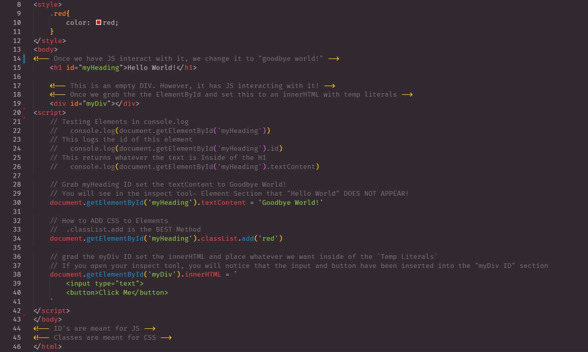
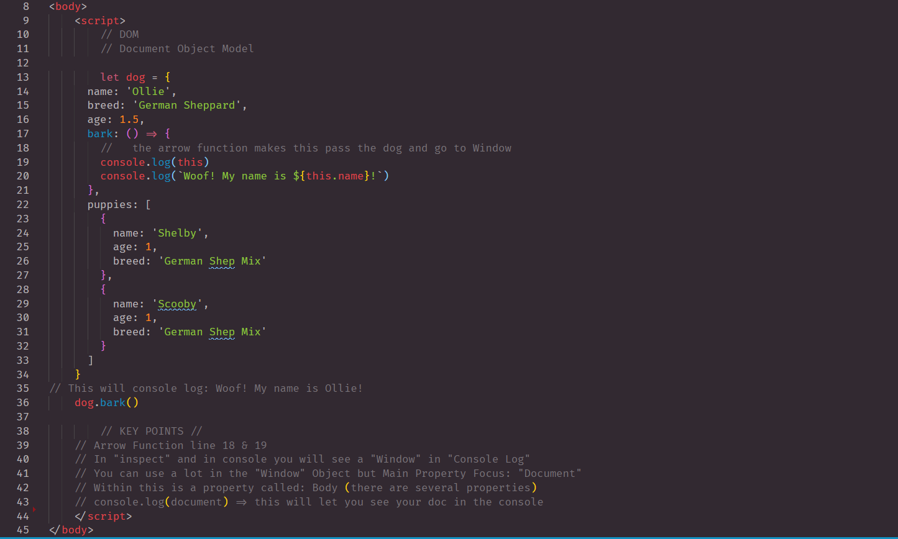
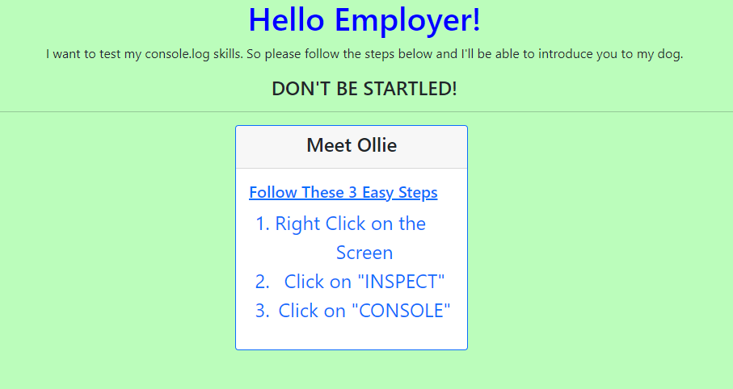
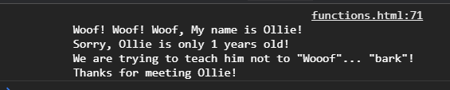

# javaScript103
## DOM Object's and Meeting My Dog, Ollie! 

> This blog post was about understanding Javascript and being able to manipulate DOM elements

***DOM Page One***



## Creating Objects and an Array with an Object. 

```

    - In this section we went over creating a function within an Object
    - Then being able to call that function 
    - Listed dogs age
    - Listed dogs breed
    - Listed dogs puppies - in a separate Array

```
***DOM Page Two***



## Meet My Dog, Ollie! 
> In this section we had to create a console.log that showed our Dog Barking.

***Home Page***



***Console Log View***



## LINKS

- [javaScript103 Link] Coming Soon!
- [Github Repo Link](https://github.com/nicholasd-uci/javaScript103)

- - -
© 2020 NPRD, Nicholas Paul Ruiz Dallas